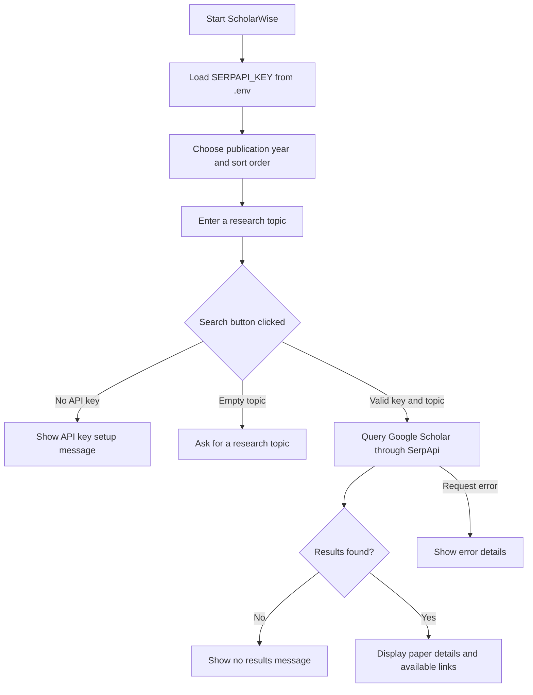

# ScholarWise

ScholarWise is a Streamlit research assistant for searching Google Scholar
results through the SerpApi API.

## Features

- Search for research papers by topic.
- Filter results by publication year.
- Sort results by relevance or newest.
- View paper summaries, citation counts, and available links or resources.

## Application Workflow



1. On startup, ScholarWise loads `SERPAPI_KEY` from the local `.env` file.
2. Choose an optional publication-year filter and a sort order in the sidebar.
3. Enter a research topic and start the search.
4. The app validates that the API key and topic are present, then sends the
   search request to Google Scholar through SerpApi.
5. Results show paper titles, publication details, descriptions, citation
   counts, and available paper or resource links. Empty results and request
   errors are reported in the app.

## Requirements

- Python 3.9 or later
- A [SerpApi API key](https://serpapi.com/)

## Setup

1. Create and activate a virtual environment:

   ```powershell
   python -m venv .venv
   .\.venv\Scripts\Activate.ps1
   ```

2. Install dependencies:

   ```powershell
   pip install -r requirements.txt
   ```

3. Create a local `.env` file from the template and add your key:

   ```powershell
   Copy-Item .env.example .env
   ```

   Set `SERPAPI_KEY` in `.env`. Do not commit or share this file.

4. Start the app:

   ```powershell
   streamlit run app.py
   ```

## Configuration

The app reads `SERPAPI_KEY` from `.env` using `python-dotenv`. Keep API keys
private; `.env` and virtual environments are excluded by `.gitignore`.
